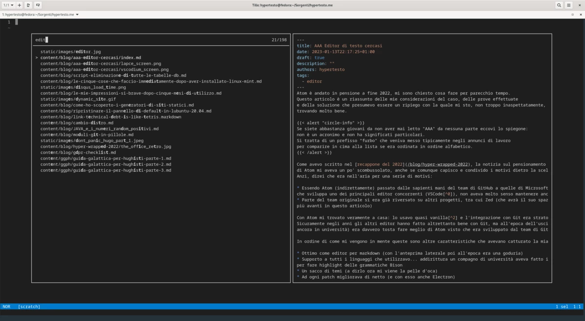

Atom è andato in pensione a fine 2022, mi sono chiesto cosa fare per parecchio tempo.
Questo articolo è un riassunto delle mie considerazioni del caso, delle prove effettuate
e della soluzione con la quale mi sto, non troppo inaspettatamente, trovando molto bene.

Con questo articolo non voglio arrivare da nessuna parte: non è una classifica e non si tratta
di "consigli d'acquisto", ma piuttosto un flusso di pensieri sul mio processo mentale di
scelta dell'editor.


Se siete abbastanza giovani da non aver mai letto "AAA" da nessuna parte eccovi lo spiegone:
non è un acronimo e non ha significati particolari.  
Si tratta di un prefisso "furbo" che veniva messo tipicamente negli annunci di lavoro 
per comparire in cima alla lista se era ordinata in ordine alfabetico.


Come avevo scritto nel [recappone del 2022](/blog/hyper-wrapped-2022), la notizia sul pensionamento
di Atom mi aveva un po' scombussolato, anche se comunque capisco e condivido i motivi dietro la scelta.
Anzi, direi che era nell'aria per una serie di motivi:

* Essendo Atom (indirettamente) passato dalle sapienti mani del team di GitHub a quelle di Microsoft, 
che sviluppa uno dei principali editor concorrenti (VSCode[^0]), non aveva molto senso mantenere anche Atom
* Parte del team originale si era già riversato su altri progetti, tra cui Zed (che avrà il suo spazio 
più avanti in questo articolo) 

Con Atom mi trovato veramente a casa: lo usavo quasi vanilla[^2] e l'integrazione con Git era stratosferica. 
Sicuramente negli anni gli altri editor hanno fatto altrettanto bene con Git, ma all'epoca dell'uscita (andavo
ancora in università) era davvero tosta fare meglio di Atom visto che era sviluppato dal team di GitHub.

In ordine di come mi vengono in mente queste sono altre caratteristiche che avevano catturato la mia attenzione:

* Ottimo come editor per markdown (con l'anteprima laterale poi all'epoca era una goduria)
* Supporto a tutti i linguaggi che utilizzavo... addirittura un compagno di università aveva fatto il suo plugin
per fare highlight delle grammatiche Bison
* Un sacco di temi (a dirlo ora mi viene la pelle d'oca)
* Ad ogni patch migliorava di netto (e con esso anche Electron)
* Aprire un editor passando una cartella come parametro del comando dato da terminale... nulla di rivoluzionario
ma era una comodità che uso ancora spesso

Ci ho messo poco ad abituarmi al suo funzionamento: shortcut e peculiarità sono tutt'ora parte della mia 
memoria muscolare. Infatti una delle difficoltà di passare ad altro è proprio cambiare le proprie abitudini.

Non ho particolari osservazioni negative sull'editor, infatti mi ha servito bene fin'ora, se non una percettibile
lentezza in avvio e in alcune situazioni e questo aveva cominciato a pesarmi già da un bel pezzo. 

## Fork tanto al chilo
Come ogni progetto opensource che si rispetti, anche Atom ha i suoi fork; dopo la notizia dell'archiviazione
ne sono nati principalmente due:

* [Atom community](https://atom-community.github.io/)
* [Pulsar Edit](https://pulsar-edit.dev/)

Da quel che ho letto sostanzialmente la community si è divisa in due dando vita a questi due progetti con obiettivi
differenti sul medio lungo periodo; ad ogni modo non ho investito tempo per capire meglio nè le motivazioni che hanno 
portato a questa scissione nè gli obiettivi a lungo termine dei due progetti. 

Aldilà delle considerazioni che si possono fare sulla natura dei fork, ho deciso di escluderli a priori dalle prove
per alcuni motivi:
* con alcuni membri del vecchio Team già su altri progetti e la *forza lavoro* rimanente già divisa in due, non so
quanto riescano a stare al passo con l'innovazione
* un editor di questo tipo è qualcosa di delicato[^1] e con notevoli complessità, perciò senza il supporto di qualche 
azienda cicciona la vedevo dura
* probabilmente questo punto potrebbe essere infondato visto che non conosco i dettagli del loro funzionamento ma 
sono piuttosto preoccupato per la situazione plugin ed estensioni visto che va rimessa in piedi tutta la baracca, e
presumo che serva qualche sorta di modifica ai plugin stessi (ovviamente spero di essere smentito visto che sarebbe
un lavoro mastodontico da portare avanti)
* era l'ora di fare il salto su qualcosa di diverso

## ~~VSCode~~ VSCodium
Ammetto che partivo molto pervenuto su questo editor essendo qualcosa fatto da Microsoft. All'epoca dei suoi primi rilasci
ero ancora molto in modalità "M$ burn in hell", ma ora col tempo ho capito che era una puttanata: occorre entrare nei meriti 
delle cose per giudicarle con coscienza.  
Può piacere o no, ma Microsoft ha creato un editor davvero solido e con una community 
a supporto molto attiva.

Ad ogni modo, nell'ultimo paio d'anni ho visto un collega di lavoro fare cose da ninja su VSCode stimolando *i miei sensi di ragno*, 
perciò l'idea di provarlo c'era già da prima che sganciassero *la bomba*.

A Dicembre, dopo un piccolo periodo di prove saltuarie, ho deciso di passare stabilmente VSCode: più precisamente
a [VSCodium](https://vscodium.com/)[^3] che è la versione alleggerita della telemetria e sotto licenza MIT.

Del passaggio posso ritenermi davvero soddisfatto non avendo avuto troppi problemi ad abituarmi a qualcosa di nuovo; dopotutto
Atom e VSCode sono concepiti un po' attorno agli stessi principi di funzionamento e si somigliano sotto molti punti di vista[^4].



Se proprio devo trovare un aspetto che ho messo di più a digerire è che l'integrazione con Git non è su un pannello separato
sulla destra ma è tra le voci del pannello di sinistra. Il cambio del suo posizionamento è comunque un aspetto sul quale non ho nessuna intenzione 
di investire del tempo: personalizzazioni di questo tipo sono l'esatto contrario del mio modo di approcciare i programmi.  

Come avevo già avuto modo di accennare nel mio [articolo sul passaggio a Fedora](/blog/cambio-distro), meglio un programma che copre 
discretamente bene tutti gli scenari con dei default "sani" piuttosto che qualcosa di ultra personalizzato sul quale poi è anche 
difficoltoso ottenere supporto.

Grossomodo lo uso in modo con le stesse identiche configurazioni che avevo in Atom:

* alcuni plugin per il supporto ai linguaggi
* uno spellchecker per quando scrivo in markdown (che è stato incredibilmente semplice far funzionare)

Come avevo già accennato nel [precedente articolo](/blog/hyper-wrapped-2022), sono positivamente colpito dalla velocità di avvio,
dalla reattività dell'editor e ho anche trovato una sciccheria tra i plugin: [Front Matter CMS](https://frontmatter.codes/) che è 
una suite di gestione di contenuti markdown con supporto anche ai generatori di siti statici, in pratica un vero e proprio CMS.  
L'articolo che state leggendo infatti lo sto scrivendo con questa comodissima *wombo combo* editor+CMS.

Penso di poter dire che VSCodium sarà il mio editor di default per un bel pezzo, almeno che nel frattempo Zed non venga rilasciato 
mantenendo tutte le promesse per le quali ho anche un certo hype.

## Zed
Zed ha decisamente catturato la mia attenzione.  
Se i nomi [Nathan Sobo](https://github.com/nathansobo), [Antonio Scandurra](https://github.com/as-cii) e [Max Brunsfeld](https://github.com/maxbrunsfeld)
vi suonano familiari c'è un motivo ben preciso: hanno tutti lavorato allo sviluppo di Atom. Non solo all'editor in quanto tale,
ma anche ad alcune tecnologie davvero rivoluzionarie; ve ne butto lì giusto due: [Teletype](https://github.com/atom/teletype) e 
[Tree-sitter](https://tree-sitter.github.io/tree-sitter/)[^5].

Zed è un editor sviluppato attorno a questi quattro paradigmi:

* Reattività: ogni operazione deve avvenire nel più breve tempo possibile e soprattutto, con un tempo sempre costante. Sembrerà una banalità da dire,
ma se lavorate otto o più ore al giorno con uno strumento, anche la più piccola *laggata* è percettibile (oltre che dannatamente fastidiosa), 
e se pensate a quante volte immettete del testo pigiando i pulsanti sulla tastiera... bè, ogni ritardo si accumula
* Massimizzare la produttività riducendo il rumore di fondo: io riassumerei questo come "funzionalità q.b.", nulla più e nulla meno di quello
che serve, personalizzabile ma non troppo. Questo trova un ulteriore dettaglio tra le FAQ per gli aspetti più inerenti ai plugin:
    > We plan to make Zed extensible via WebAssembly, but we're taking a different approach than we did with Atom. Our goal is to make Zed fast, stable, and collaborative first, extensible second. We'll be taking a more conservative approach with our APIs to ensure we can preserve our core values even as users add extensions.
* La conversazione dovrebbe avvenire contestualmente alla scrittura del codice: questa considerazione è elaborata negli ulteriori due punti
    - l'intero editor è costruito attorno alla collaborazione real time che è intesa proprio modificare la stessa pagina nello stesso momento con 
    latenza minima e soprattutto senza incasinarsi la vita
    - è possibile "conversare" su qualsiasi punto del codice anche se si tratta di una revisione precedente (un po' come se fossimo su GitHub con la history e i commenti, ma tutto
    comodamente nella stessa finestra di lavoro)

Queste premesse si sono per ora materializzate in una serie di [feature](https://zed.dev/features) molto interessanti, soprattutto per chi è interessato all'editing collaborativo. Le due
cose che mi piacciono maggiormente sono che è completamente scritto in Rust e che usa una libreria per la UI (con accelerazione GPU) che si sono completamente sviluppati in casa. Su questo punto ha inciso molto il fatto che quando hanno iniziato il progetto non c'erano ancora librerie per UI molto mature.

Ho già detto quanto mi piace che non sia l'ennesima robaccia basata su Electron?

Ad ogni modo non ho ancora avuto il piacere di provarlo su strada non avendo ancora ottenuto l'accesso alla alpha. Per ora mi limito a seguire
il [blog](https://zed.dev/blog) e [l'account Twitter ufficiale](https://twitter.com/zeddotdev) dove postano spesso brevi video e news croccanti.

Siccome il progetto, soprattutto per la parte che concerne l'editing collaborativo dove ci sono sicuramente server di mezzo, non è per nulla privo di costi,
c'è da chiedersi come verrà monetizzato. A quanto dichiarato nelle [FAQ](https://zed.dev/faq) il core verrà rilasciato con licenza open-source e le 
funzionalità legate a team e collaborazione avranno un canone. Fair enough, di qualcosa devono pur campare.  

Qualche anno fa non ci avrei nemmeno pensato, ma ora come ora non trovo assurdo pagare qualcosa che uso, soprattutto se si tratta di lavoro.

## Lapce
[Lapce](https://lapce.dev/) è un altro editor open source molto promettente scritto in Rust. 
Può essere tranquillamente considerato l'editor spirituale di [Xi](https://xi-editor.io/), che purtroppo [non è più sviluppato](https://xi-editor.io/2022/12/09/status-update.html).  
Da Xi ha ereditato la [Rope Science](https://xi-editor.io/docs/rope_science_00.html) di cui vi invito a leggere seguendo il link poichè si tratta di una dissertazione davvero
interessante su codice e strutture dati.

A differenza di Zed, la libreria UI utilizzata in questo caso è [Druid](https://github.com/linebender/druid). Su questa libreria, e più in generale su Rust e le UI, vale la pena fare una piccola analisi magari in un futuro articolo.



Ho fatto un po' di prove con l'[ultimo rilascio disponibile (0.2.5)](https://github.com/lapce/lapce/releases/tag/v0.2.5) e devo dire che nel complesso comporta molto bene: 

* è veloce da far schifo: l'avvio sembra perfino finto per quanto è istantaneo (provato su un paio di progettini Java e con il repo di questo blog)... VSCode è davvero lontano anni luce in questa metrica
* mi piace molto com'è organizzato il pannello laterale di sinistra: l'idea di base è raggruppare
le funzionalità un po' come fa VSCode, ma le tab sono organizzate orizzontalmente; mi sembra una scelta davvero intelligente per guadagnare spazio in orizzontale
* nello stesso pannello trova posto anche la parte di integrazione con git: è una piacevole via di
mezzo tra quella di Atom e VSCode.*Voto diesci*.

Ovviamente siamo ancora ad uno stato embrionale dello sviluppo: seppure "la ciccia" sia già presente, mancano parecchie piccole cosine qua e là e soprattutto è ancora molto grezzo (se guardate lo screenshot vedete che è tutto un po' "piatto").

Se lo provate aspettatevi comunque di incappare in qualche bug, soprattutto se cominciate a smanettare con le impostazioni le cose possono precipitare molto rapidamente: sono riuscito a
piantare la mia macchina con la CPU al 100% facendo un paio di audaci cambi di font[^6] 🔥.

## Sublime Text 4
Grande assente della rassegna... la verità è che l'ho installato, l'ho usato una decina di minuti e poi me ne sono completamente dimenticato 😅.  
Pazienza, si vede che non mi aveva convinto!

## Helix
[Helix](https://helix-editor.com/) è qualcosa di completamente differente.  

Per farvela breve, durante il mio vagabondaggio nella giungla degli editor, non avevo escluso a priori di provare
a passare a qualcosa di più estremo come un editor modale. Inutile dire che quando si parla di editor modali il 
primo che salta alla mente è Vim.

Vim lo uso sempre, guai non averlo installato sui server! Lo trovo molto comodo per editare file di configurazione, fare qualche replace al volo
oppure aprire e navigare direttamente i file zip (sì, può farlo e mi salva parecchio tempo ogni volta!).

A livello di editing però cercavo qualcosa di più completo con un albero dei file a sinistra e le principali comodità di una GUI. Ho quindi provato
varie soluzioni: da un [NeoVim](https://neovim.io/) liscio fino alle distribuzioni come [LunarVim](https://www.lunarvim.org/) e [AstroNvim](https://astronvim.com/).

Le varie distribuzioni di Vim mi piacciono molto sulla carta, ma hanno un problema per me fondamentale: ci sono troppi pezzi che girano
e a quel punto invece che concentrarmi su *come* usare l'editor in maniera diretta, dovrei dedicare parecchio tempo a capire come configurarlo, 
scriptarlo, e gestire tutta la mole di plugin che a loro volta hanno le loro configurazioni.  
Insomma, per quanto sarebbe bello imparare a fare anche queste cose, la mia paranoia di avere qualcosa di ragionevolmente
comodo con i suoi default e senza troppi pezzi che girano, ha sempre il sopravvento.

Helix è stato una piacevole scoperta:

* È scritto in Rust (ormai vi uscirà dalle orecchie 😂)
* È parecchio autocontenuto... non è proprio un singolo eseguibile ma ci sono comunque pochi file e librerie di mezzo
* È come usare Vim, ma al contrario
Mi spiego meglio: in Vim prima decidete l'azione e poi su cosa, invece in Helix la logica è invertita
poichè prima fate la selezione e poi l'azione[^7]. So già che chi usa Vim mi sta già lanciando il malocchio, ma trovo questo flusso di lavoro
più logico e, tra l'altro, il fatto di lavorare prima sulle selezioni mi aiuta a focalizzare meglio quello che sto facendo
* Tranne l'assenza del file tree laterale, che comunque è sostituito egregiamente da un file picker comodissimo, le funzionalità che cerco ci sono tutte
* La sottolineatura della sintassi è fatta con i [tree-sitter](https://tree-sitter.github.io/tree-sitter/)

<figure>
  
  <figcaption class="text-center">Una panoramica di Helix. Prima l'apertura che mostra in automatico il file picker, poi l'apertura del file
  markdown di questa pagina, poi l'apertura del menù di scelta rapida con <kbd>spazio</kbd> ed infine la riapertura del filepicker.</figcaption>
</figure>

Helix è entrato di diritto nell'insieme di programmi che non devono mancare sul mio computer locale. Non lo uso per programmare, ma piuttosto
quando devo lavorare con file dove non ho bisogno di un IDE (come avverebbe ad esempio per Java e Kotlin) ma mi serve poter navigare
comodamente nell'alberatura delle cartelle di progetto.

Il progetto è sicuramente molto giovane, ma non ho avvertito mancanze particolari o le tipiche instabilità di un prodotto ancora in forte sviluppo. 
Tra l'altro [il file tree laterale potrebbe fare presto la sua comparsa](https://github.com/helix-editor/helix/pull/5566)!

## Note di chiusura 

E con questo si chiude questo articolo. Come avevo scritto all'inizio, non avevo obiettivi particolari se non avere una sottospecie
di narrazione degli eventi del processo decisionale che mi ha portato su VSCode ed Helix. 

Non considerate le mie scelte come indicazioni su quale sia l'editor migliore... in questi casi si tratta, come direbbe il mitico Giorgione, *di
scelte private*.

Se avete qualche altra chicca da farmi provare o volete condividere la vostra esperienza sarò lieto di leggervi tra i commenti!

[^0]: Che tra l'altro ha riscosso fin da subito notevole consenso.
[^1]: Passatemi il termine, non mi veniva in mente un'altra parola per esprimere il concetto. 
Volendola espandere scriverei "centrale nel flusso di lavoro di molti sviluppatori"
[^2]: Ovviamente nel valutare plugin ed estensioni escludo quelle per il supporto ai vari linguaggi; quelle servono per forza di cose
ed è così che funzionava anche Atom
[^3]: Installato con rpm e non da FlatHub. Avevo avuto qualche magagna con la versione flatpak che in realtà sarebbe la prima scelta
se procedete ad installarlo dal Software Center di Fedora
[^4]: Uno tra tutti: che sono sviluppati con Electron a cui ormai sono abbastanza allergico
[^5]: Video consigliato: [https://emacsconf.org/2022/talks/treesitter/](https://emacsconf.org/2022/talks/treesitter/)
[^6]: Sono piuttosto sicuro che il colpevole sia l'Inconsolata [Nerd Font](https://www.nerdfonts.com/).
[^7]: La stessa modalità che viene utilizzata da [Kakoune](https://kakoune.org/), da cui Helix ha preso parecchie cose