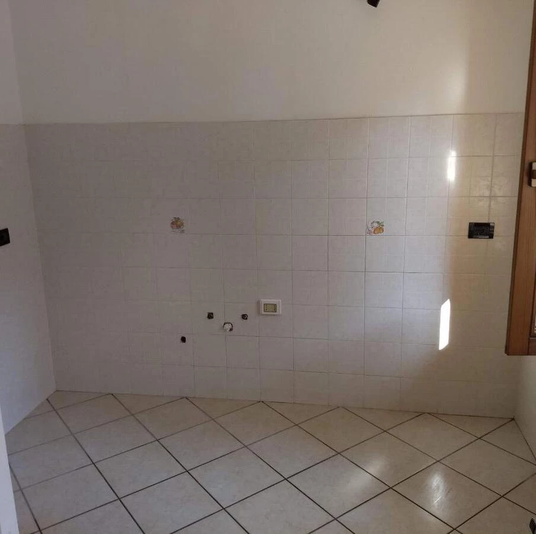

È dall'anno scorso che avevo voglia di fare un articolo del genere, il 2022 era proprio l'anno giusto per inaugurare quella che spero diventerà un'usanza... e poi avevo anche il titolo azzeccato, quindi non potevo proprio tirarmi indietro.

Il 2022 è stato in generale un anno abbastanza di merda, non so se meglio o peggio del 2021, ma non serve che vi illustri io i motivi visto che sono cose sotto gli occhi di tutti.  

Dal punto di vista personale ci sono state un sacco di evoluzioni: il passaggio in telelavoro, il diventare proprietario di casa (e ancora non mi ci sono abituato), il cannibalismo e tante altre belle cose.

Ogni avvenimento o aspetto principale ha il suo capitolo dedicato, preparatevi perchè non sarà un articolo breve.

## Cambio residenza
Con la scusa dei lockdown sono tornato nel mio paese natale già nel 2020, e ci sono anche rimasto dopo aver mollato il mio appartamento in affitto a Trento. Ho fatto dapprima un po' il nomade in casa dei miei: prima con loro, poi in un appartamento libero, poi in un altro e con l'occasione del mio
passaggio ufficiale in telelavoro avvenuta questa primavera ho ufficializzato la mia nuova residenza al piano terra... ben due piani sotto a dove era in origine![^10]

Nel corso dell'anno sono diventato proprietario di due appartamenti (a piano terra, per l'appunto) dai quali poi ne ho ricavato uno solo. Ho fatto letteralmente tre cose, il minimo indispensabile per far quadrare la burocrazia e sistemarmi al meglio: 
* un piccolo muro in cartongesso con una porta per unire i due appartamenti (le due entrate erano in fondo ad un corridoio una su un lato e una di fronte, quindi ho fatto la porta un pelo più avanti per chiuderli entrambi) 
* una scrivania su misura per il mio home-office (spoiler: mi è costata molto meno che prendere due scrivanie con due mobili decenti per riempire bene lo spazio)
* ho sistemato doccia e lavandino nel bagno che sarebbe diventato il principale visto che quel che c'era era messo piuttosto male

Queste tre cose che a tanti sembreranno da nulla mi hanno fatto abbastanza *girare i cojoni*: le ho pagate tutte molto di più del preventivato (grazie Putin), sia materiali che manodopera sono arrivati in ritardo (il lavandino merita un  paragrafo tutto suo) e tutta la burocrazia in generale mi ha causato abbastanza stress. In realtà penso sia più il mio modo di vedere il mondo che è incompatibile con il modo in cui funzionano queste cose burocratiche.

Comunque alla fine tutto è andato al suo posto soprattutto grazie al preziosissimo contributo ~~dei miei operai assunti irregolarmente~~ dei miei famigliari[^1].

### The lavandin saga
Sistemare il lavandino con la sua specchiera è stato un calvario:

1. Il lavandino mi è stato consegnato *a toc* (a pezzi), anche se non ricordo di aver specificato questo metodo di consegna


2. Nella consegna mancava comunque un colle che doveva contenere il mobile sottolavabo
3. Dopo un bel po' di telefonate con l'assistenza per il reso, mi confermano l'accettazione della pratica e mi dicono che l'articolo rotto verrà rispedito e che il collo mancante arriverà poichè *xera pa strada* (era per strada)
4. Dopo una decina di giorni senza notizie ricontatto per avere info sulla spedizione del nuovo articolo e su quello che ormai è evidente che è un pacco smarrito ma mi assicurano che è tutto a posto
5. Dopo altri dieci giorni richiamo e mi tengono al telefono più di un'ora di cui almeno 45 in attesa perchè dovevano parlare con il magazzino (ma secondo me se ne sono andati a pranzo[^40]). A fine chiamata comunque salta fuori che il mobile sottolavabo non era proprio stato spedito e mi dicono che possono provvedere subito... MA... il lavandino (quello rotto) non lo hanno più e non hanno nemmeno un'idea di quando tornerà disponibile. Decido quindi con molta compostezza di mandarli a quel paese e procedere per altre vie
6. Tento quindi di prendere qualcosa di simile come dimensioni da Ikea...
7. Sul sito i pezzi che individuo risultano disponibili ma non per la spedizione... e la cosa bizzarra è che i pezzi sono disponibili singolarmente ma non nella classica combo specchio, lavabo e sottolavabo poichè non risultano disponibili
8. Dall'assistenza mi dicono che i pezzi ci sono ma sono in 3 negozi diversi (se ben ricordo: Milano, Bolzano e Roma), a quel punto dico che per me non ci sono problemi a pagare 3 spedizioni differenti.
9. Dopo qualche minuto di attesa in cui si dovevano confrontare con i superiori mi dicono che comunque non possono procedere a spedire e che potevo solo andare a prendere la merce in presenza. A quel punto ho rinunciato[^50].
10. Alla fine sono andato in un negozio di articoli edilizi qua vicino... ma ci ho speso quasi 450€ invece dei 100€ iniziali. 

L'unica cosa che mi era rimasta dell'ordine iniziale era il mobile-specchio, che comunque aveva preso qualche botta perchè il legno era crepato in un punto che fortunatamente rimane nascosto, il cristallo dello specchio invece era miracolosamente intatto. Comunque alla fine l'ho tenuto per farci altro.  

Il lavandino è sicuramente di alta qualità e il lavoro alla fine è venuto molto bene... ma se ci ripenso mi sale il kraken 😡😡.

### Fuffi e altre bestie mitiche

Fuffi, Il gatto dei miei, è super contento di avere ~~lo schiavetto~~ il portinaio che risponde alle chiamate di apertura porta con solerzia[^20]. È anche dedito alla potatura delle mie piante e, a tempo perso, è anche arredatore di interni.  


Anche i gatti del vicinato a quanto pare hanno gradito la mia presenza: due hanno già provato a fare irruzione e una terza (una gatta nera un tantino invadente) si è fatta anche un bel giretto dentro mentre ero di spalle.

Di tanto in tanto compare anche la volpe, ma almeno non prova ad entrarmi in casa! Almeno spero.
## The office
Questo in realtà dovrebbe far parte del capitolo precedente, ma meritava un capitolo tutto suo con blackjack e squillo di lusso!  

Dovendoci passare la maggior parte del tempo sia per lavoro che per svago ho prestato parecchia attenzione alla "progettazione" dello spazio. Nella mia testa i requisiti erano questi:

* recuperare il vecchio angolo cottura di uno dei due appartamenti per ricavarci l'ufficio
* non rompere mattoni o piastrelle
* avere più spazio possibile sulla scrivania
* avere l'illuminazione corretta per non affaticare la vista
* nel resto dello spazio metterci sicuramente l'attrezzatura per fare esercizi a corpo libero, poi magari un pouf o un angolino relax

Per la divisione degli spazi non c'era molta scelta: l'unico posto sensato dove piazzare la scrivania era esattamente l'angolo dove prima c'era il piano della cucina, il resto della stanza era quindi la parte "polifunzionale".

Il grosso ostacolo era il muro che sulla sinistra andava a chiudere lo spazio con una forma a L un po' balorda.



Mi ci sono arrabattato un bel po' perchè non riuscivo a trovare una combinazione di scrivania e mobili che sfruttasse bene quello spazio. Sicuramente la mia pignoleria ha giocato un ruolo primario nell'esclusione del 99% delle scrivanie, ma di quelle realmente da ufficio ce ne sono poche[^60], costano tutte parecchio e soprattutto non sono riuscito a trovare nulla che con una forma a L sfruttasse bene lo spazio a disposizione.  

Nemmeno cercando di combinarne due normali riuscivo ad arrivare a misura. L'unica soluzione per me bella e funzionale che includeva dei cassetti e un armadio per andare
a chiudere bene il lato corto mi sarebbe costata più di 1500€ IVA esclusa.

A sbloccare la situazione è stato mio cognato[^70], geometra di professiòn, che ha avuto un'ottima idea per:
* non rompere nessun muro o piastrella
* sfruttare al 100% lo spazio ricavabile dall'area per fare la scrivania

In pratica mi ha suggerito, visto che già dovevo fare il cartongesso per il portoncino di ingresso, di coprire le piastrelle della cucina con un singolo pannello di cartongesso, e fare una scrivania totalmente a sbalzo.  


Per i *non ancora imparati*  la scrivania a sbalzo non ha le gambe che poggiano sul pavimento, ma è direttamente fissata al muro.


Mi ha quindi fatto un progettino e abbiamo fatto fare la scrivania su misura ad una falegnameria locale; questa soluzione è costata circa la metà della combo di mobili più costosa ed è venuta davvero una figata!  
Beccatevi il time-lapse del lavoro!

La luce che vedete sopra alla scrivania è una buona lampada LED a sospensione da 4000 Kelvin con illuminazione diretta + indiretta per un totale di 7200 lumen; la trovate [qui](https://www.lampade.it/lampada-a-sospensione-led-jolinda-per-l-ufficio.html) se vi interessa.  
Infine, come ultimo tocco all'illuminazione, le tende sono state sostituite con delle normali veneziane in modo da poter regolare per bene la luce che entra.


Per il resto della stanza abbiamo optato per una specie di paretina attrezzata che in realtà è stata fatta con un mobile e una libreria unite assieme.


Ho voluto mettere anche un po' di piante e un paio di quadri che ho preso direttamente da un amico che, a differenza mia, le foto le sa fare ;-)

Per chi lo ha notato dalla foto: no, non sono i mobili ad essere *sgherli*, sono proprio i muri che non sono a piombo.

## Il Leapcon 2022
Dopo due anni di tentativi andati a vuoto causa *Coviddi*, siamo finalmente riusciti a trovarci per il Leapcon. Cos'è il Leapcon? È l'evento ufficiale, che sperabilmente sarà a cadenza annuale, dell'organizzazione di Star Citizen di cui faccio parte. Tutti bravi ragazzi e anche brave forchette!

Incidentalmente il Leapcon è anche stata la prima occasione in cui sono andato in ferie da qualche parte negli ultimi 15 anni.



Siamo stati in una villa in Toscana e io ho fatto anche tappa da Firenze un giorno prima. Se escludiamo il caldo torrido a Firenze a cui non voglio nemmeno pensare, ho fatto due giorni da nababbo:

* sono stato più tempo in piscina che sulla terra ferma[^91]
* ho mangiato delle fiorentine spettacolari (e io non ho nemmeno mosso un dito per aiutare in cucina, mi dichiaro assolutamente colpevole)

Ma non è questo il motivo per cui c'è un capitolo dedicato alle mie ferie! Infatti ve le sto citando solo per vantarmi del fatto che sono stato accompagnato da Firenze alla villa a Chianciano (e ritorno) nientepopodimeno che da **Bumblebee** in persona!



In sintesi: *son contento aver partecipato manifestazione*.

## Twitter, l'esodo e il fediverse
Non so nemmeno da dove cominciare, la faccenda è di dominio pubblico e la quasi totalità dei passaggi è disponibile in rete, un riassunto temo non renderebbe giustizia. Io comunque ci provo.  

Il tutto è cominciato con Elon Musk che a fine Gennaio si è comprato un bel po' di azioni di Twitter, rendendolo il maggior azionista, poi ha provato a comprarsi direttamente la baracca con un'offerta, salvo poi fare marcia indietro.  
Non è chiaro cosa intendesse fare, ma molti concordano nel dire che sia stata una manovra per abbassare il valore di Twitter in modo da comprarlo ad un prezzo più basso.

Durante tutto il tira e molla si è letto di tutto: lui si è dichiarato "un assolutista della libertà di espressione", poi contrario alla censura, poi si è dichiarato apertamente contrario al ban di Trump dalla piattaforma... insomma, ha sfornato parecchie perle. 

Alla fine del tira e molla, il 27 Novembre, Twitter è diventato di sua proprietà e ha cominciato a fare le sue *Muskiate*:
* ha licenziato da un giorno all'altro buona parte del management
* ha licenziato in tronco anche parecchi impiegati con metodi pittoreschi

* ha licenziato altri impiegati a mezzo mail dicendo in buona sostanza "da adesso si lavorerà *hardcore*, se va bene rimani, altrimenti *ciaone*"
* ha provato a riassumere dei dipendenti (forse si era reso conto dei numeri in ballo a quel punto)
* ha spento non so quanti microservizi perchè superflui a detta sua (si è visto poi quanti disservizi ci sono stati)
* ha proposto gli abbonamenti per la spunta blu
* quando hanno introdotto la spunta blu ci sono stati degli account verificati palesemente in contrasto a quello che era il regolamento (tipo Dio era un account con la spunta blu)
* ha riabilitato parecchi account controversi, per quello di Trump c'è addirittura stato un "referendum lampo" di 24 ore!
* nel contempo sono stati bannati account di alcuni giornalisti (non ho approfondito i motivi)
* ha cominciato dei sondaggi su come cambiare l'interfaccia (d'altronde è risaputo che gli utenti sono ordini di grandezza più in gamba di chi lo fa per lavoro)
* ha vietato i post contenenti link a piattaforme concorrenti

Bello eh? Io dico spettacolare.



Comunque... parecchia gente non era (e non è tutt'ora) tranquilla a rimanere sulla piattaforma, tant'è che una moltitudine di utenti si è riversata nel fediverso, in particolare su [Mastodon](https://github.com/mastodon/mastodon).  
Non era così che speravamo che la gente si accorgesse del fediverso, ma questo è. 

Per il sottoscritto è stata l'occasione di rifarsi un account su [mastodon.uno](https://mastodon.uno/) (l'istanza generalista gestita dai ragazzi di [Devol](https://devol.it/)) giacchè non avevo più i dati di accesso del vecchio account, e comunque non lo avevo mai usato.
L'istanza mi piace molto e ho ritrovato parecchia della gente che faceva già parte della mia "bolla tech" di Twitter.  

Per ora lo sto usando in maniera abbastanza passiva (non posto) e mi sto trovando davvero bene a fruire i contenuti con [Fedilab](https://fedilab.app/) che è a pagamento ma vale i soldi spesi a mio avviso.

## Mi hanno *sunsettato* Atom, maledizione!
L'otto Giugno 2022 è stata data la [comunicazione ufficiale](https://github.blog/2022-06-08-sunsetting-atom/) che Atom sarebbe andato in pensione entro fine anno. 

Ho usato Atom praticamente dalla suo primo rilascio ufficiale quindi mi è dispiaciuto leggere questa notizia, comunque sia, trovo assolutamente valide le motivazioni esposte dal team di GitHub (e quindi Microsoft).

Gli anni scorsi avevo già provato a migrare su altro (VSCode in primis) ma nonostante Atom fosse percettibilmente lento (come gran parte della robaccia fatta in Electron) mi ci sono sempre sentito a casa soprattutto con l'integrazione con GIT.

Ad oggi, sono passato su Codium (la versione di VSCode snellita della parte di telemetria M$); mi ci devo ancora abituare ma devo dire che non è stato poi così traumatico, anzi è percettibilmente più veloce, perlomeno all'avvio.  
Per come lo uso io ha già quasi tutto di default, ci ho solo installato un po' di robine carine per il Markdown (Front Matter CMS è stata una gran scoperta, spero di scriverci un articolo più avanti) e uno spell checker che mi pare funzioni piuttosto bene.

Durante l'anno ho sperimentato anche con [Helix](https://helix-editor.com/) e [Lapce](https://lapce.dev/) e ho anche addocchiato [Zed](https://zed.dev/).  
Se questo tema vi interessa sappiate che ho già un articolo in cantiere; volendo darvi un'anticipazione secondo me il più interessante sarà Zed anche se non ho ancora avuto accesso alla beta per provarlo, Helix invece è stata una gran scoperta e l'ho introdotto con poco sforzo nel mio workflow al posto di Vim.

## Audiolibri
Ad essere completamente onesti il mio rito di iniziazione con gli audiolibri è avvenuto a Natale 2021,
ma le ore di ascolto le ho fatte tutte quest'anno, perciò fa parte del wrapped 2022 di diritto. 

L'idea di iniziare ad ascoltare audiolibri si basava per me su un'unica considerazione: riposare gli occhi già molto irritati per conto loro e per le innumerevoli ore che passo davanti al PC. Una soluzione di ripiego, diciamo.

E invece non solo non si è rivelata una soluzione di ripiego, anzi, mi sono davvero preso male per la saga di Harry Potter letta da Pannofino. Una goduria per le orecchie, dico davvero[^90]. Poi anche la storia, che con i film non mi aveva particolarmente entusiasmato, mi ha tenuto incollato dall'inizio alla fine!  

Col senno di poi capisco perchè all'epoca i film non mi erano particolarmente piaciuti: la trama è davvero troppo compressa per rimanere nei tempi (non che fosse facile fare diversamente, eh).

Vi svelo anche un incantesimo che ho appreso: 
Accio commenti!


Dopo Harry Potter, che se ben ricordo ho finito di ascoltare tra Maggio e Giugno, ho ascoltato un paio di altre cosine e poi ho scoperto la mia seconda droga: Sandman.

Sandman, che non è un libro ma bensì è un fumetto, è fatto un po' diversamente rispetto ad un audiolibro "convenzionale" letto da un solo speaker: ci sono più voci, rumori, musica... insomma praticamente un film senza la componente visiva. Molto figo.

Con Sandman sono arrivato a metà del terzo atto che è uscito non troppo tempo fa.  
Se ne avete l'occasione, oltre a leggere il fumetto originale, ascoltate l'audiolibro che rispetto al telefilm uscito quest'estate su Netflix[^80] è più fedele e ha un piglio decisamente più horror! 

## Podcast
Come per gli audiolibri, il 2022 è stato l'anno in cui ho cominciato a seguire sul serio un po' di podcast. Prima mi capitava di ascoltarli di rado e comunque solo cose con cui mi imbattevo più o meno per caso.

Questi sono i podcast che ho cominciato ad ascoltare quest'anno:

* [DataKnightmare: L'algoritmico è politico](https://open.spotify.com/show/6Es1phkjQsJtfx4JSej4r7) di Walter Vannini  
*Il livello di *rant* che ha raggiunto con le ultime puntate è a dir poco godurioso, non confondete il *rant* con una critica sterile comunque.*
* [Ciao Internet](https://open.spotify.com/show/5q7jh01YLFtru7iqUlj6lu) di Matteo Flora  
*Di norma fa anche vedere cose a schermo, perciò se avete il tempo da dedicargli probabilmente è più efficace seguirlo da YouTube.*
* [Pillole di bit](https://www.pilloledib.it/) di Francesco Tucci  
*Avevo ascoltato qualche puntata già nel 2020 essendo stato uno dei miei primi follow su Twitter, è molto vario ma mai scontato nella scelta degli argomenti.*
* [Pressapoco](https://open.spotify.com/show/08hNPPNrbwPK8zrn9bir98) di Riccardo Palombo (c'è anche il [blog](https://pressappoco.it/))  
*Riccardo non credo che abbia bisogno di presentazioni. Impossibile non conoscerlo visto che i suoi podcast vengono su come i funghi 😂.*

Ho preferito mettervi i link a Spotify; ovviamente non sono solo lì, potete ascoltarli su tutte le principali piattaforme, io personalmente li ascolto su Spotify per non installare altre app sul cellulare.

Molti dei podcast e degli audiolibri li ascolto direttamente a letto (che dovrebbe essere una scusa per coricarmi un pochino prima), perciò stavo valutando l'idea di acquistare una di quelle cuffie da letto (una cosa tipo [questa](https://www.amazon.it/dp/B08QRVSTXF/ref=sspa_dk_detail_0?pd_rd_i=B08QRVSTXF&pd_rd_w=csPA7&content-id=amzn1.sym.c9f95566-a642-4649-b2d0-4bdc25387eea&pf_rd_p=c9f95566-a642-4649-b2d0-4bdc25387eea&pf_rd_r=4V9YVM7TT8KJTAY75MNE&pd_rd_wg=7Z7q3&pd_rd_r=f2fe828f-05b2-4e51-b3e8-525b30dbdc85&s=electronics&sp_csd=d2lkZ2V0TmFtZT1zcF9kZXRhaWw&th=1)). 

Se avete consigli d'acquisto *sono tutt'orecchi!* Pun intended.

## Cambiamenti al sito  
Apro il capitolo con un evento tragicomico: la prima issue aperta sul repo del blog!



L'errore era presente da parecchio e con la scusa che la [Guida Galattica per Hughisti](/ggph) ha una sua voce nel menù principale, era anche in bella vista a beneficio di tutto il pubblico ludibrio 😅. A proposito: prometto che un giorno la porterò avanti!

Sempre nella stessa segnalazione mi è stato fatto notare che non funzionava il canonico `hello@hypertesto.me`, errore che ho fixato al volo. Grazie [trikko](https://github.com/trikko) non me ne sarei mai accorto da solo!

Sempre ad agosto il sito ha visto un revamp piuttosto importante visto che il tema che usavo cominciava ad invecchiare non proprio bene. Il nuovo tema è decisamente più "fresco" e al passo coi tempi.  
L'unico neo è che i siti fatti con Tailwind CSS si somigliano tutti parecchio, dovrò trovare un modo di differenziarlo meglio dalla massa, ma a questo ci penserò più avanti.

Durante l'anno ho fatto talmente tante modifiche alle CORS policy che ho perso il conto di quante volte le ho rotte. I commenti di conseguenza non hanno funzionato per un periodo.

Comunque con la scusa dei fix e degli aggiornamenti al tema ho avuto modo di tenere piuttosto aggiornata la versione di Hugo, anzi, l'occasione è stata anche ghiotta per implementare un minimo di workflow per avere una versione si staging del sito tramite Netlify... inutile dire che all'inizio ho fatto la modifica, ho spaccato mezza roba e me ne sono accorto dopo un mese abbondante.

Shame on me.

## Piani per il 2023
Non mi piace particolarmente il concetto di fissare degli obiettivi per l'anno... preferisco vedere le cose in ottica più *rolling-release*; diciamo che vedo più questa lista come un "cose da fare opportunisticamente prima o poi, forse mai".  

Comunque sia ecco le cose in ordine rigorosamente casuale:

* Studiare il protocollo Activity Pub
* *Indiewebizzare* il sito
* Imparare Rust (quest'anno non ci ho dedicato più di un paio d'ore)
* Imparare qualche rudimento in più di javascript
* Studiare tailwind (questo sito è fatto con esso, ma non direttamente da me)
* Studiare alpine.js
* Migrare [SC Mining App](https://sc-mining.app) a tailwind+alpine e passare il sito su [GitHub pages](https://pages.github.com/) in modo da sbarazzarmi anche del dominio che non mi va più di pagare

Visto che nell'ultimo punto si parla di una voce di spesa, uno degli obiettivi che vorrei assolutamente perseguire, visto che già me lo ero dato lo scorso anno, è quello di fare una panoramica di tutti i servizi che pago (sì, pago la roba che uso) e cercare di razionalizzarli un pochino.  

Se riesco a risparmiare abbastanza vorrei farmi il piano Proton Unlimited che ha dentro davvero tutto quel che può servire: mail con dominio personalizzato, Calendario, VPN e ora anche un'ottima alternativa a Google Drive.  
L'idea di fondo è levare quanta più roba possibile da Google, e il piano con Proton è particolarmente allettante, a maggior ragione perchè già ora pago SimpleLogin [che da questa primavera fa parte della famiglia Proton](https://simplelogin.io/blog/simplelogin-join-proton/).

## Note di chiusura
E questo era il mio personale wrapped 2022, nulla di più che un mio flusso di pensieri lungo e articolato (forse meglio: incasinato). Perciò se siete riusciti a resistere fino alla fine avete tutta la mia stima.  

Se vi va, potete *mipiaciare* l'articolo direttamente qui sulla pagina, sui social o anche lasciare un commento.  

**Esco altre foto del gatto solo a pagamento.**

[^10]: Per fortuna che quando lavoravo in sede a Trento non avevo ancora spostato la residenza, altrimenti altro che ritorno a casa dopo il primo lockdown! [Chiuso in casa](/chiuso-in-casa) avrebbe avuto un bel po' di puntate extra!
[^20]: Salvo poi richiedere nuovamente l'apertura per uscire dopo nemmeno un minuto[^30]
[^30]: Oppure entrare dalla finestra per poi tirare dritto e uscire dal portone... gatti
[^40]: Poco male perchè nel mentre ho pranzato pure io
[^50]: In realtà dentro di me ho vissuto la scena in stile [Suor Nausicaa del bergamasco ricoperta di lacrime di immensa carità cristiana](https://www.youtube.com/watch?v=6zJH2Bpx1-g)
[^60]: E quelle da fighetti con i led RGB, quelle con le gambe storte o uscite direttamente da un romanzo ottocentesco le lascio volentieri ad altri
[^70]: Che nel mentre mi ha anche fatto diventare zio, con un po' in ritardo rispetto al piano di rilascio iniziale, nientepopodimeno che l'11/11/2022... una data che è perfino pornografica da quanto è bella
[^80]: Mi sono auto-imposto di non polemizzare su come Netflix infili a forza *un certo tema* in tutto quel che produce... chi ha capito ha capito.
[^90]: Leggesi: *eargasm*
[^91]: Un ringraziamento particolare va a Santa Caterina: il patrono di tutti gli scottati sotto al sole cocente, che al momento giusto ti riprende e ti mette anche la crema solare (che io avevo rigorosamente dimenticato a casa)
[^1]: Che hanno anche fatto l'esperienza mistica di imbiancare l'ufficio sulle note di Ruggero dei Timidi.